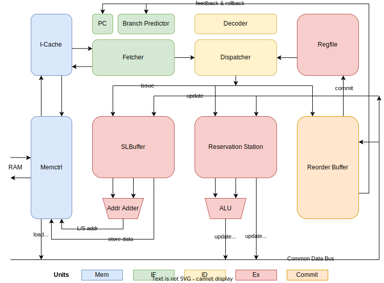

# ProjectAris 

     

🕹️ *ProjectAris* aims at implementing a single core, single thread and RV32I based CPU in Verilog. ~~BTW it's named after [AL1S](https://bluearchive.fandom.com/wiki/Tendou_Alice) from [BlueArchive&trade;](https://bluearchive.nexon.com/home)~~.

## Checkpoints

- [x] **week 6** 创建仓库

- [x] **week 8** 完成[电路设计](docs/assets/cpu_design_draft.png)

- [x] **week 10** 完成 Instruction Fetch 部分代码（see [here](https://github.com/Yang-Chincheng/projectAris/tree/84fca7828e6d293057636ffb09641892f8041e0b/riscv/src)），尝试仿真运行

- [x] **week 12** 各个 CPU 模块文件基本完成，完成 `cpu.v` 连线（see code [here](https://github.com/Yang-Chincheng/projectAris/tree/fcf80fa9b4958a8108bab669fdbcd8a8f2720a13/riscv/src)）

- [x] **week 14** Simulation 通过 `gcd`

- [x] **week 16** Simulation 通过除 `tak`，`heart`，`pi` 之外的所有样例 (see code [here](https://github.com/Yang-Chincheng/projectAris/tree/eeaf6cded8560fa22d4d251d6e03b88c6a2ca6ca/riscv/src))

- [x] **week 18** FPGA 通过所有样例

## Design



+ RSA: RISC-V 32-bit Integer, Unprivileged (supported instruction list see [here](https://github.com/Yang-Chincheng/RISCV-Simulator-2022/tree/pipeline#readme), official spec see [here](https://github.com/riscv/riscv-isa-manual/releases/download/Ratified-IMAFDQC/riscv-spec-20191213.pdf))

+ Arch: Out-of-Order scheduling with speculation, using Tomasulo's algorithm

+ Feature: Single core, single thread, single issue, single ALU, with L1-ICache, without L1-DCache, without L2-Caches, single port RAM, physics address only

+ Module details
  
  + ICache: Direct mapping instruction cache. Cache Line Size 16B (contains 4 instructions), Cache Line Number 32, ICache Size 16*32=512B;
  
  + Branch Predictor: Maintain 2-bit saturating counters for local branch history;
  
  + Regfile: 32 32-bit registers for data, each companied by a renaming register;
  
  + RS: Reservation Station, 16 entries, handling all instructions except L/S ones;
  
  + SLB: Store/Load Buffer, 16 entries, handling L/S instructions;
  
  + ROB: Reorder Buffer, 32 entries, handling instruction commits;
  
  + CDB: Common Data Bus, in this implementation there are separate buses for load results and ALU calculation results;
  
  + Memctrl: Handling Memory R/W requsts from ICache and SLB.  

## Performance

**[Platform]** WSL1, Ubuntu 20.04.1 LTS in windows 10 21H2 on Lenovo&reg; LEGION&trade; laptop, with 11th Gen Intel&reg; Core&trade; i5-11400H @ 2.70GHz processor

**[Device]** BASYS3&trade; Xilinx&trade; ARTIX&trade;-7 FPGA, programed by Vivado® ML Edition 2022.2

(check [Basys-3-Master.xdc](riscv/src/Basys-3-Master.xdc) for detailed implementation constrain information)

---

Test result with **100MHz** clock frequency: 

| array_test1    | array_test2   | basicopt1    | bugarian    | expr               | gcd              |
| -------------- | ------------- | ------------ | ----------- | ------------------ | ---------------- |
| 0.015625s      | 0.015625s     | 0.015625     | 1.234375s   | 0.015625s          | 0.015625s        |
| **hanoi**      | **heart**     | **looper**   | **lvalue2** | **magic**          | **manyargument** |
| 1.218750s      | 775.7656s     | 0.015625s    | 0.015625s   | 0.031250s          | 0.000000s        |
| **multiarray** | **pi**        | **qsort**    | **queens**  | **statement_test** | **superloop**    |
| 0.015625s      | 1.875000s     | 4.500000s    | 1.062500s   | 0.000000s          | 0.015625s        |
| **tak**        | **testsleep** | **uartboom** |             |                    |                  |
| 0.062500s      | 8.609375s     | 0.750000s    |             |                    |                  |

Performance comparison among different clock frequencies:

|        | WNS      | TNS      | WHS     | THS     | pi.c      | heart.c     |
| ------ | -------- | -------- | ------- | ------- | --------- | ----------- |
| 80MHz  | 0.872ns  | 0.000ns  | 0.079ns | 0.000ns | 2.359375s | 971.453125s |
| 100MHz | -0.779ns | -50.13ns | 0.049ns | 0.000ns | 1.875000s | 775.765625s |
| 120MHz | -2.421ns | -874.5ns | 0.018ns | 0.000ns | 1.531250s | 633.546875s |

## Dependencies

+ [riscv-toolchain]([GitHub - riscv-collab/riscv-gnu-toolchain: GNU toolchain for RISC-V, including GCC](https://github.com/riscv-collab/riscv-gnu-toolchain)): RISC-V C and C++ cross-compiler, generating RV32I assembly code
+ [serial](https://github.com/wjwwood/serial): USB-serial adapters for in WSL, creating a serial connection with FPGA board
+ [iStyle](https://github.com/thomasrussellmurphy/istyle-verilog-formatter): Verilog formatter used in the early stage of this project
+ [Vivado&reg;](https://www.xilinx.com/support/download.html): Integrated development environment for FPGA device (v2022.2)

## Testing & Usage

> Following methods are suitable for (and perhaps only for) **WSL1** in windows 10
> 
> Check [here](https://github.com/ACMClassCourses/RISCV-CPU/tree/doc/doc) for more configuration or debugging guidance.

MakeFile under `riscv/` is provided for running simulation/FPGA tests.  

### Simulation

1. Install and configure riscv-gnu-toolchain;

2. Modify the `riscv_toolchain` varibale in `riscv/MakeFile`, use the path to riscv-toolchain on the device;

3. Under path `riscv/`, run the following script (replace `<sim_testcase>` with [can be part of] the name of the testcase) to trigger simulation test:
   
   ```bash
   make test_sim name=<sim_testcase> 
   ```

### FPGA

1. Install and configure serial;

2. Connect FPGA device to PC/Laptop with a USB cable;

3. Use Vivado&reg; IDE to generate bitstream file and program the FPGA device;

4. Determine the USB port ID of FPGA in the Windows Device Manager, assume it's COM4, run the following scripts in terminal to setup the environment: 
   
   ```bash
   export LD_LIBRARY_PATH="/tmp/usr/local/lib/:$LD_LIBRARY_PATH"
   sudo chmod 666 /dev/ttyS4
   ```

5. Under path `riscv/`, run the following script (replace `<fpga_testcase>` with [can be part of] the name of the testcase) to trigger FPGA test:
   
   ```bash
   make test_fpga name=<fpga_testcase>
   ```

6. FPGA device may need to be rebooted or reprogrammed if alerts like `UART assertion failed` are raised.

## About🤞

This project serves as an assignment for the course (2022-2023-1)-CS2951-1 in SJTU.

Consult the [assignment repository](https://github.com/ACMClassCourses/RISCV-CPU) for more infomation.


